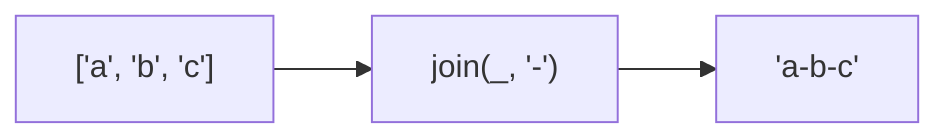

Joins array elements into a string.
**Deprecated**: Use `array.join()` directly.

```mermaid
flowchart LR
    A["['a', 'b', 'c']"] --> B["join(_, '-')"]
    B --> C["'a-b-c'"]
```

### Native Equivalent

```typescript
// ❌ join(arr, '-')
// ✅ arr.join('-')
```
