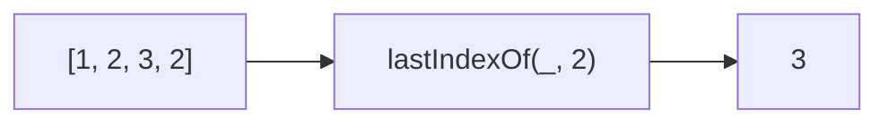

Returns the index of the last occurrence of a value.
**Deprecated**: Use `array.lastIndexOf()` directly.


### Native Equivalent

```typescript
// ❌ lastIndexOf(arr, value)
// ✅ arr.lastIndexOf(value)
```
