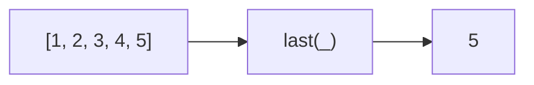

Gets the last element of an array.
**Deprecated**: Use `array[array.length - 1]` or `array.at(-1)` directly.


### Native Equivalent

```typescript
// ❌ last(arr)
// ✅ arr[arr.length - 1]
// ✅ arr.at(-1)  // ES2022
```
