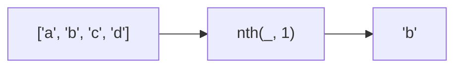

Gets the element at index n.
**Deprecated**: Use `array[n]` or `array.at(n)` directly.

```mermaid
flowchart LR
    A["['a', 'b', 'c', 'd']"] --> B["nth(_, 1)"]
    B --> C["'b'"]
```

### Native Equivalent

```typescript
// ❌ nth(arr, n)
// ✅ arr[n]
// ✅ arr.at(n)  // ES2022
```
