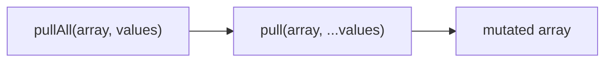
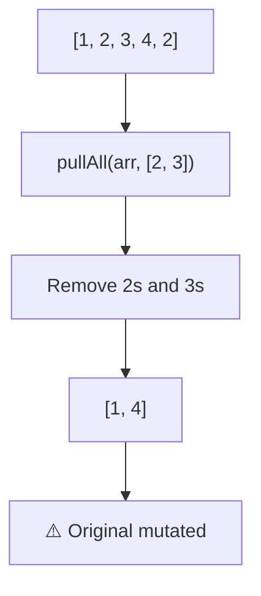

Removes all specified values from array in place (mutates).

### Mutation Flow

### Common Inputs

| Array | Values | Result |
|-------|--------|--------|
| `[1, 2, 3, 4, 2]` | `[2, 3]` | `[1, 4]` |
| `['a', 'b', 'c']` | `['b']` | `['a', 'c']` |

> ⚠️ **Deprecated**: Use `difference()` from Arkhe for immutable operations.
