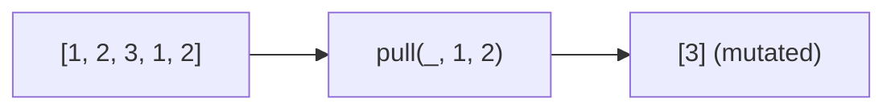

Removes all given values from an array (mutates).
**Deprecated**: Use immutable `filter()` or `without()` instead.


### Native Equivalent

```typescript
// ❌ pull(arr, ...values)  // mutates
// ✅ arr.filter(x => !values.includes(x))  // immutable
```
