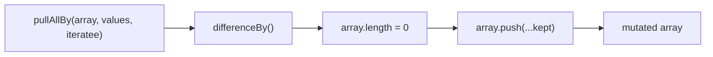
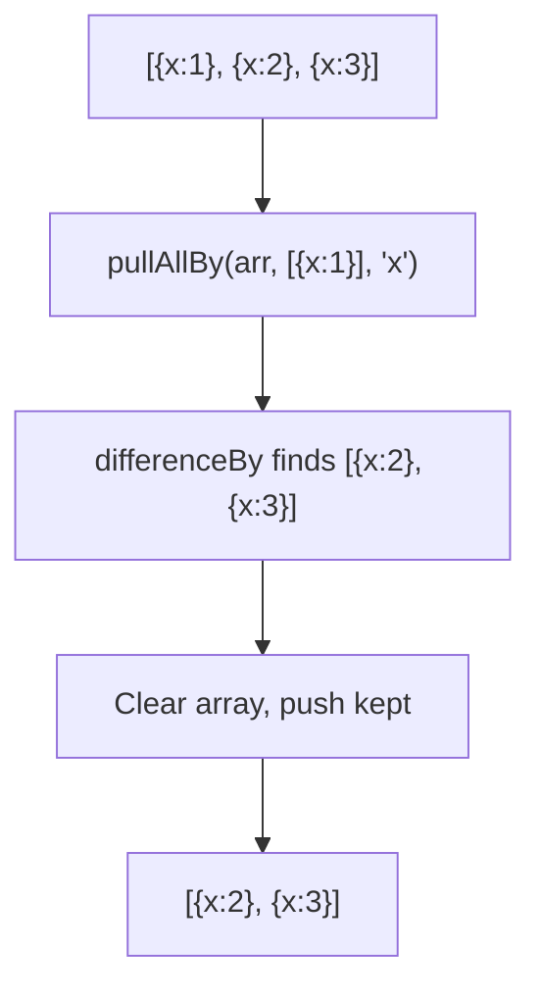

Removes values from array using an iteratee for comparison (mutates).

### Mutation Flow

### Common Inputs

| Array | Values | Iteratee | Result |
|-------|--------|----------|--------|
| `[{x:1}, {x:2}]` | `[{x:1}]` | `'x'` | `[{x:2}]` |
| `[1.2, 2.3, 3.4]` | `[2.1]` | `Math.floor` | `[1.2, 3.4]` |

> ⚠️ **Deprecated**: Use `differenceBy()` from Arkhe for immutable operations.
