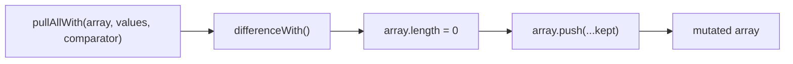
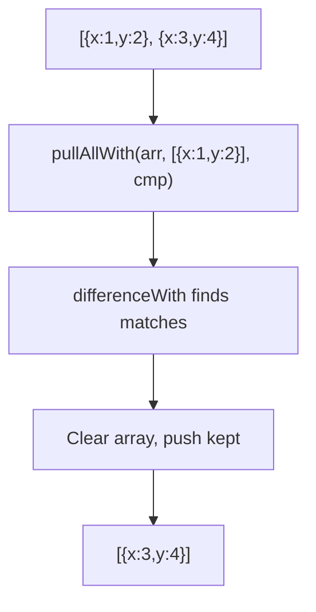

Removes values from array using a comparator function (mutates).

### Mutation Flow

### Common Inputs

| Array | Values | Comparator | Result |
|-------|--------|------------|--------|
| `[{x:1}, {x:2}]` | `[{x:1}]` | `(a,b) => a.x === b.x` | `[{x:2}]` |

> ⚠️ **Deprecated**: Use `differenceWith()` from Arkhe for immutable operations.
