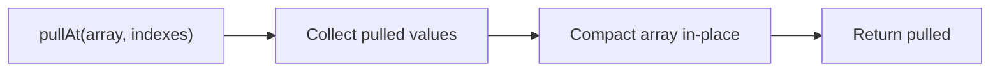
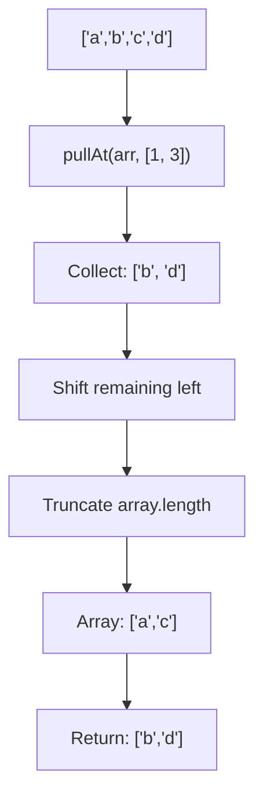

Removes elements at specified indexes and returns them (mutates).

### Processing Flow

### Common Inputs

| Array | Indexes | Pulled | Remaining |
|-------|---------|--------|-----------|
| `['a','b','c','d']` | `[1, 3]` | `['b','d']` | `['a','c']` |
| `[1, 2, 3]` | `[0]` | `[1]` | `[2, 3]` |

> ⚠️ **Deprecated**: Use `.filter()` with index check for immutable operations.
