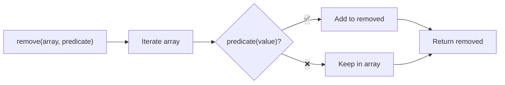
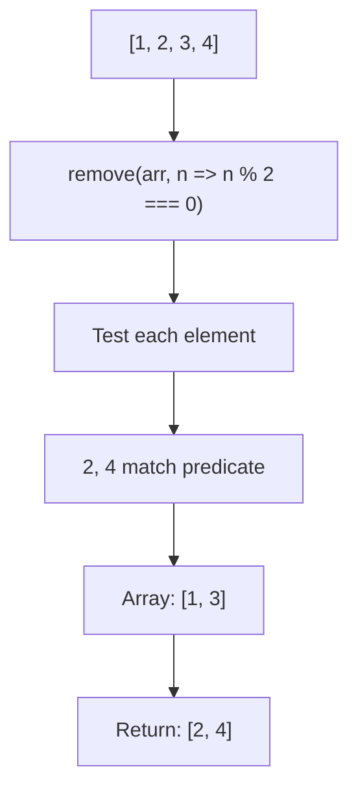

Removes elements matching predicate and returns them (mutates).

### Processing Flow

### Common Inputs

| Array | Predicate | Removed | Remaining |
|-------|-----------|---------|-----------|
| `[1, 2, 3, 4]` | `n => n % 2 === 0` | `[2, 4]` | `[1, 3]` |
| `['a', '', 'b']` | `x => !x` | `['']` | `['a', 'b']` |

> ⚠️ **Deprecated**: Use `.filter()` for immutable operations.
