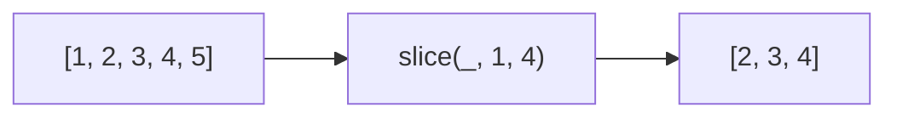

Creates a shallow copy of a portion of an array.
**Deprecated**: Use `array.slice()` directly.

```mermaid
flowchart LR
    A["[1, 2, 3, 4, 5]"] --> B["slice(_, 1, 4)"]
    B --> C["[2, 3, 4]"]
```

### Native Equivalent

```typescript
// ❌ slice(arr, 1, 4)
// ✅ arr.slice(1, 4)
```
