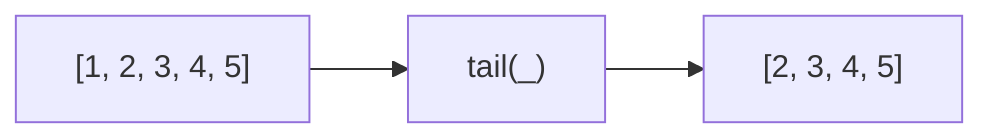

Gets all but the first element of array.
**Deprecated**: Use `array.slice(1)` directly.

```mermaid
flowchart LR
    A["[1, 2, 3, 4, 5]"] --> B["tail(_)"]
    B --> C["[2, 3, 4, 5]"]
```

### Native Equivalent

```typescript
// ❌ tail(arr)
// ✅ arr.slice(1)
```
