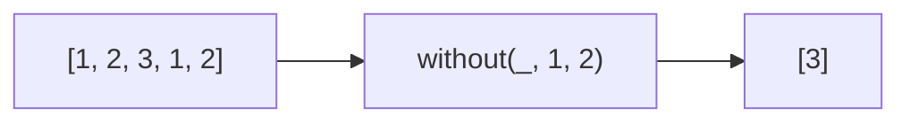

Creates an array excluding specified values.
**Deprecated**: Use `array.filter()` directly.


### Native Equivalent

```typescript
// ❌ without(arr, 1, 2)
// ✅ arr.filter(x => x !== 1 && x !== 2)
// ✅ arr.filter(x => ![1, 2].includes(x))
```
