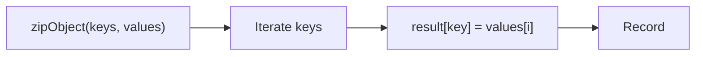
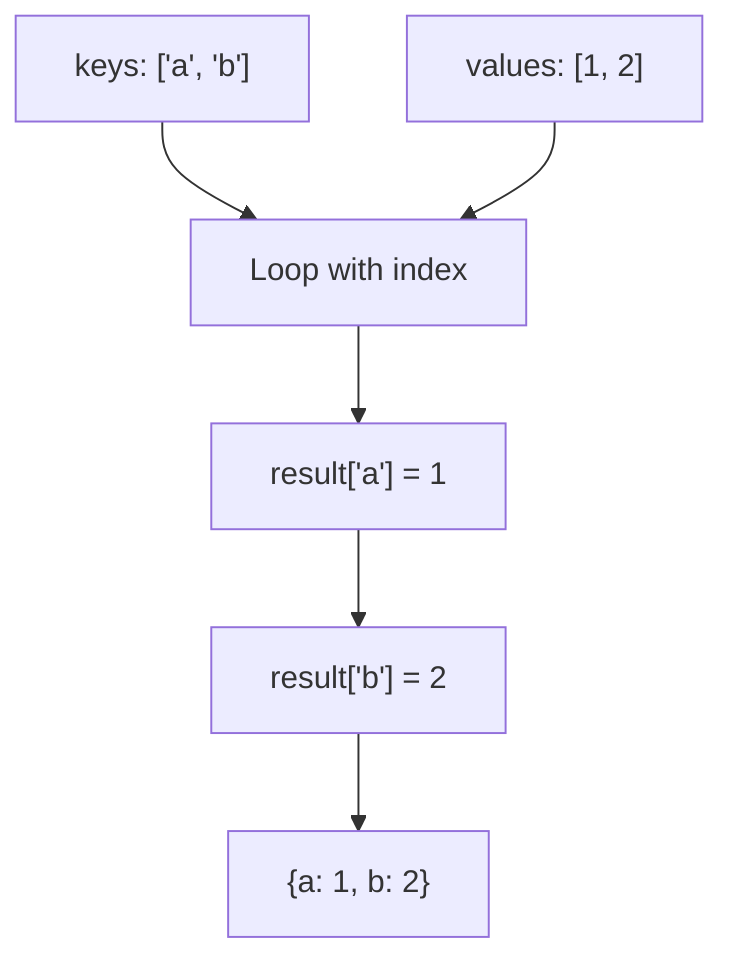

Creates an object from arrays of keys and values.

### Processing Flow

### Common Inputs

| Keys | Values | Result |
|------|--------|--------|
| `['a', 'b']` | `[1, 2]` | `{a: 1, b: 2}` |
| `['x', 'y', 'z']` | `[10, 20]` | `{x: 10, y: 20, z: undefined}` |

> ⚠️ **Deprecated**: Use `Object.fromEntries()` with `map()` or `zip()`.
