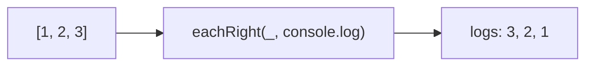

Iterates over elements from right to left.
**Deprecated**: Use `array.reverse().forEach()` or loop backward.


### Native Equivalent

```typescript
// ❌ eachRight(arr, fn)
// ✅ [...arr].reverse().forEach(fn)
// ✅ for (let i = arr.length - 1; i >= 0; i--) fn(arr[i])
```
