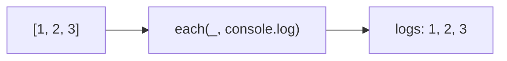

Iterates over elements of collection.
**Deprecated**: Use `array.forEach()` directly.

```mermaid
flowchart LR
    A["[1, 2, 3]"] --> B["each(_, console.log)"]
    B --> C["logs: 1, 2, 3"]
```

### Native Equivalent

```typescript
// ❌ each(arr, fn)
// ✅ arr.forEach(fn)
```
