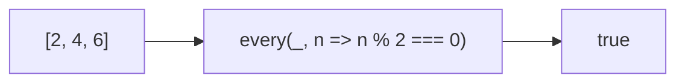

Checks if all elements pass the predicate.
**Deprecated**: Use `array.every()` directly.

```mermaid
flowchart LR
    A["[2, 4, 6]"] --> B["every(_, n => n % 2 === 0)"]
    B --> C["true"]
```

### Native Equivalent

```typescript
// ❌ every(arr, fn)
// ✅ arr.every(fn)
```
