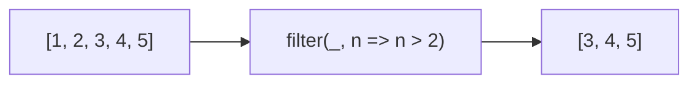

Creates an array with elements that pass the predicate.
**Deprecated**: Use `array.filter()` directly.

```mermaid
flowchart LR
    A["[1, 2, 3, 4, 5]"] --> B["filter(_, n => n > 2)"]
    B --> C["[3, 4, 5]"]
```

### Native Equivalent

```typescript
// ❌ filter(arr, fn)
// ✅ arr.filter(fn)
```
