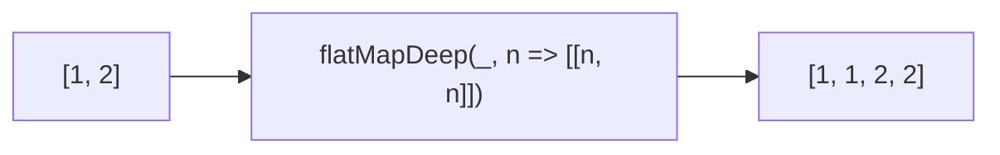

Maps and deeply flattens result.
**Deprecated**: Use `flatMap()` + `flat(Infinity)`.

```mermaid
flowchart LR
    A["[1, 2]"] --> B["flatMapDeep(_, n => [[n, n]])"]
    B --> C["[1, 1, 2, 2]"]
```

### Native Equivalent

```typescript
// ❌ flatMapDeep(arr, fn)
// ✅ arr.flatMap(fn).flat(Infinity)
```
