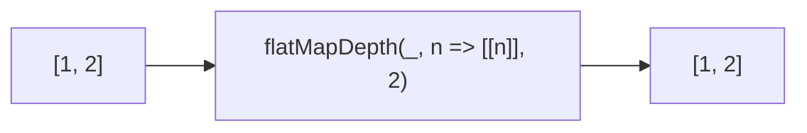

Maps and flattens result to specified depth.
**Deprecated**: Use `flatMap()` + `flat(depth)`.


### Native Equivalent

```typescript
// ❌ flatMapDepth(arr, fn, depth)
// ✅ arr.flatMap(fn).flat(depth - 1)
```
