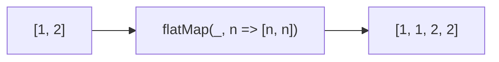

Maps and flattens result by one level.
**Deprecated**: Use `array.flatMap()` directly (ES2019).

```mermaid
flowchart LR
    A["[1, 2]"] --> B["flatMap(_, n => [n, n])"]
    B --> C["[1, 1, 2, 2]"]
```

### Native Equivalent

```typescript
// ❌ flatMap(arr, fn)
// ✅ arr.flatMap(fn)
```
