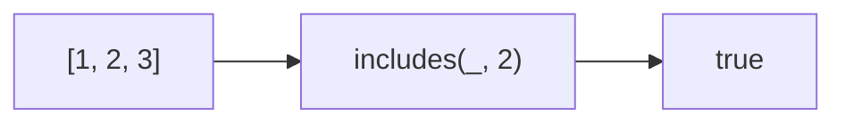

Checks if value is in collection.
**Deprecated**: Use `array.includes()` directly (ES2016).

```mermaid
flowchart LR
    A["[1, 2, 3]"] --> B["includes(_, 2)"]
    B --> C["true"]
```

### Native Equivalent

```typescript
// ❌ includes(arr, value)
// ✅ arr.includes(value)
```
