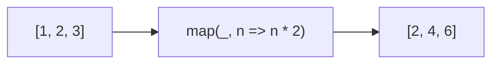

Creates an array by running each element through iteratee.
**Deprecated**: Use `array.map()` directly.

```mermaid
flowchart LR
    A["[1, 2, 3]"] --> B["map(_, n => n * 2)"]
    B --> C["[2, 4, 6]"]
```

### Native Equivalent

```typescript
// ❌ map(arr, fn)
// ✅ arr.map(fn)
```
