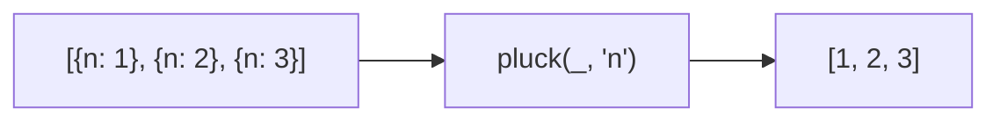

Extracts values of a property from all objects.
**Deprecated**: Use `array.map()` directly.

```mermaid
flowchart LR
    A["[{n: 1}, {n: 2}, {n: 3}]"] --> B["pluck(_, 'n')"]
    B --> C["[1, 2, 3]"]
```

### Native Equivalent

```typescript
// ❌ pluck(arr, 'name')
// ✅ arr.map(x => x.name)
```
