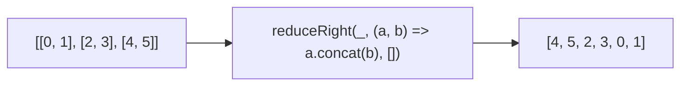

Reduces collection from right to left.
**Deprecated**: Use `array.reduceRight()` directly.

```mermaid
flowchart LR
    A["[[0, 1], [2, 3], [4, 5]]"] --> B["reduceRight(_, (a, b) => a.concat(b), [])"]
    B --> C["[4, 5, 2, 3, 0, 1]"]
```

### Native Equivalent

```typescript
// ❌ reduceRight(arr, fn, init)
// ✅ arr.reduceRight(fn, init)
```
