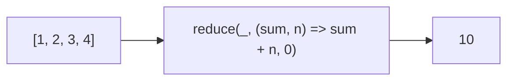

Reduces collection to a value by iterating elements.
**Deprecated**: Use `array.reduce()` directly.

```mermaid
flowchart LR
    A["[1, 2, 3, 4]"] --> B["reduce(_, (sum, n) => sum + n, 0)"]
    B --> C["10"]
```

### Native Equivalent

```typescript
// ❌ reduce(arr, fn, init)
// ✅ arr.reduce(fn, init)
```
