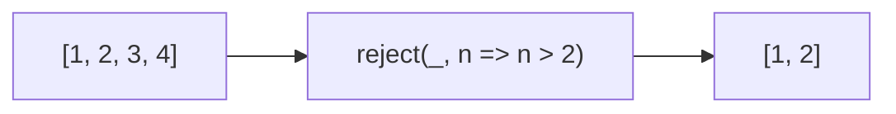

Returns elements that do NOT pass the predicate (opposite of filter).
**Deprecated**: Use `array.filter()` with negated predicate.


### Native Equivalent

```typescript
// ❌ reject(arr, predicate)
// ✅ arr.filter(x => !predicate(x))
```
