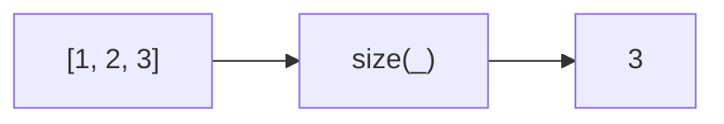

Gets the length of collection.
**Deprecated**: Use `.length` or `.size` directly.

```mermaid
flowchart LR
    A["[1, 2, 3]"] --> B["size(_)"]
    B --> C["3"]
```

### Native Equivalent

```typescript
// ❌ size(arr)
// ✅ arr.length

// ❌ size(map)
// ✅ map.size
```
