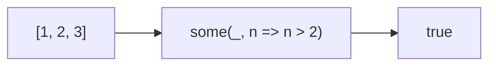

Checks if any element passes the predicate.
**Deprecated**: Use `array.some()` directly.

```mermaid
flowchart LR
    A["[1, 2, 3]"] --> B["some(_, n => n > 2)"]
    B --> C["true"]
```

### Native Equivalent

```typescript
// ❌ some(arr, fn)
// ✅ arr.some(fn)
```
