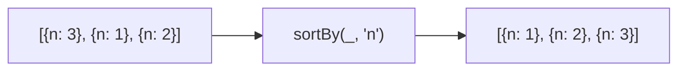

Creates an array sorted by iteratees.
**Deprecated**: Use `array.toSorted()` (ES2023) or `[...arr].sort()`.


### Native Equivalent

```typescript
// ❌ sortBy(arr, 'age')
// ✅ [...arr].sort((a, b) => a.age - b.age)
// ✅ arr.toSorted((a, b) => a.age - b.age)  // ES2023
```
