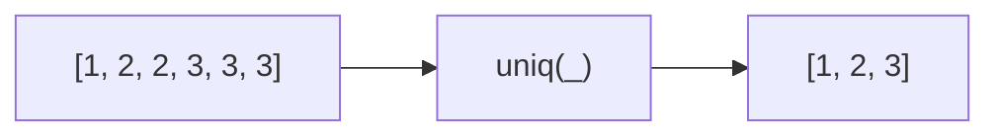

Creates a duplicate-free version of an array.
**Deprecated**: Use `[...new Set(array)]` directly (ES2015).


### Native Equivalent

```typescript
// ❌ uniq(arr)
// ✅ [...new Set(arr)]
// ✅ Array.from(new Set(arr))
```
