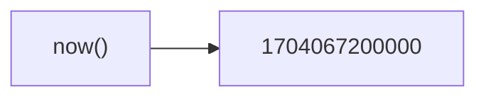

Gets the timestamp of current time.
**Deprecated**: Use `Date.now()` directly (ES5).

```mermaid
flowchart LR
    A["now()"] --> B["1704067200000"]
```

### Native Equivalent

```typescript
// ❌ now()
// ✅ Date.now()
```
