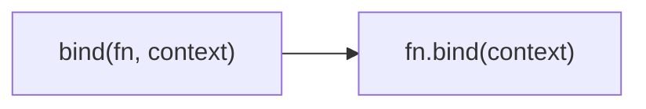

Creates a function bound to a specific context.
**Deprecated**: Use `Function.prototype.bind()` directly.


### Native Equivalent

```typescript
// ❌ bind(fn, context, ...args)
// ✅ fn.bind(context, ...args)
```
