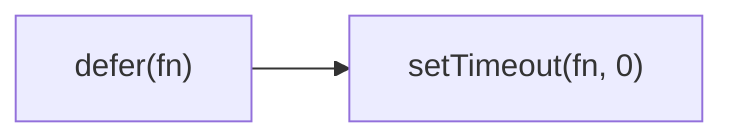

Defers invoking func until the current call stack clears.
**Deprecated**: Use `setTimeout(fn, 0)` or `queueMicrotask()` directly.


### Native Equivalent

```typescript
// ❌ defer(fn)
// ✅ setTimeout(fn, 0)
// ✅ queueMicrotask(fn)
```
