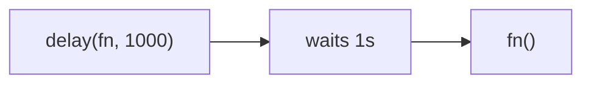

Invokes func after wait milliseconds.
**Deprecated**: Use `setTimeout()` directly.

```mermaid
flowchart LR
    A["delay(fn, 1000)"] --> B["waits 1s"]
    B --> C["fn()"]
```

### Native Equivalent

```typescript
// ❌ delay(fn, 1000, arg1)
// ✅ setTimeout(() => fn(arg1), 1000)
```
