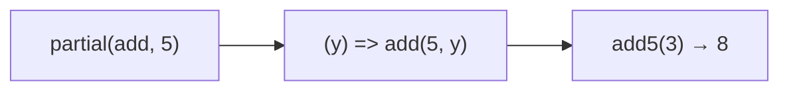

Creates a function with partial arguments applied.
**Deprecated**: Use `Function.prototype.bind()` or arrow functions.


### Native Equivalent

```typescript
// ❌ partial(fn, arg1)
// ✅ fn.bind(null, arg1)
// ✅ (arg2) => fn(arg1, arg2)
```
