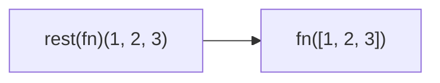

Creates a function that collects arguments into array.
**Deprecated**: Use rest parameters directly.

```mermaid
flowchart LR
    A["rest(fn)(1, 2, 3)"] --> B["fn([1, 2, 3])"]
```

### Native Equivalent

```typescript
// ❌ rest(fn)
// ✅ (...args) => fn(args)
```
