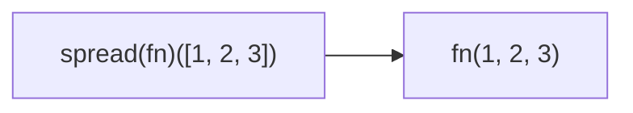

Creates a function that spreads array as arguments.
**Deprecated**: Use spread syntax directly.

```mermaid
flowchart LR
    A["spread(fn)([1, 2, 3])"] --> B["fn(1, 2, 3)"]
```

### Native Equivalent

```typescript
// ❌ spread(fn)(args)
// ✅ fn(...args)
```
