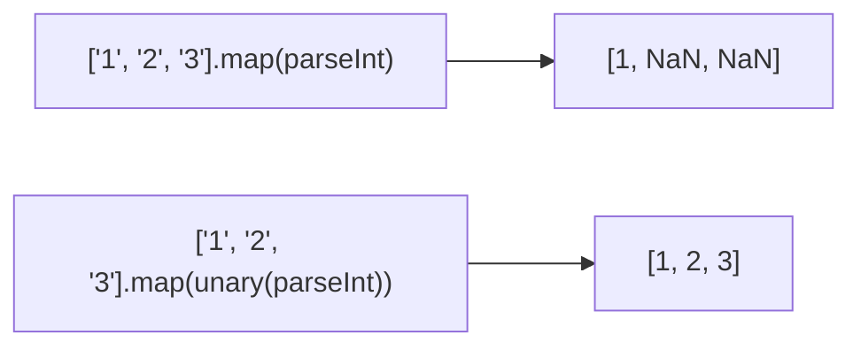

Creates a function that accepts up to one argument.
**Deprecated**: Use an arrow function.

```mermaid
flowchart LR
    A["['1', '2', '3'].map(parseInt)"] --> B["[1, NaN, NaN]"]
    C["['1', '2', '3'].map(unary(parseInt))"] --> D["[1, 2, 3]"]
```

### Native Equivalent

```typescript
// ❌ arr.map(unary(parseInt))
// ✅ arr.map(x => parseInt(x))
```
