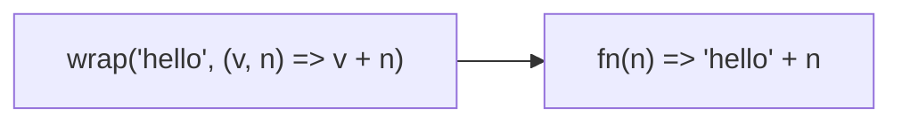

Creates a function that wraps value with wrapper function.
**Deprecated**: Use an arrow function.


### Native Equivalent

```typescript
// ❌ wrap(value, wrapper)
// ✅ (...args) => wrapper(value, ...args)
```
