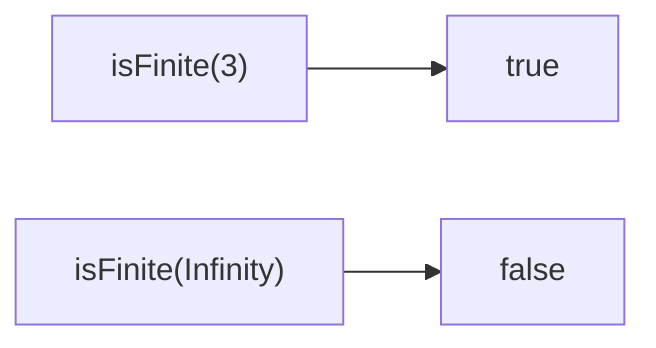

Checks if value is a finite number.
**Deprecated**: Use `Number.isFinite()` directly (ES2015).

```mermaid
flowchart LR
    A["isFinite(3)"] --> B["true"]
    C["isFinite(Infinity)"] --> D["false"]
```

### Native Equivalent

```typescript
// ❌ isFinite(value)
// ✅ Number.isFinite(value)
```
