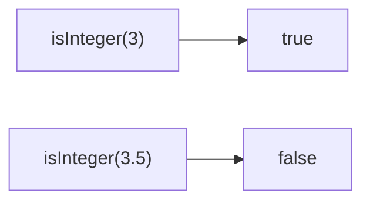

Checks if value is an integer.
**Deprecated**: Use `Number.isInteger()` directly (ES2015).

```mermaid
flowchart LR
    A["isInteger(3)"] --> B["true"]
    C["isInteger(3.5)"] --> D["false"]
```

### Native Equivalent

```typescript
// ❌ isInteger(value)
// ✅ Number.isInteger(value)
```
