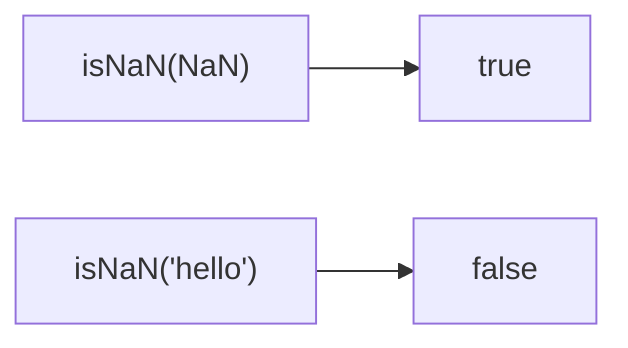

Checks if value is NaN.
**Deprecated**: Use `Number.isNaN()` directly (ES2015).


### Number.isNaN vs global isNaN

| Value | `Number.isNaN` | `global isNaN` |
|-------|----------------|----------------|
| `NaN` | ✅ true | ✅ true |
| `'hello'` | ❌ false | ✅ true |

### Native Equivalent

```typescript
// ❌ isNaN(value)
// ✅ Number.isNaN(value)
```
