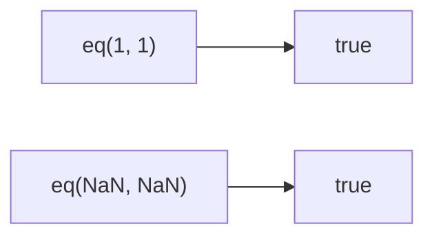

Performs SameValueZero comparison between two values.
**Deprecated**: Use `===` or `Object.is()` directly.


### Native Equivalent

```typescript
// ❌ eq(a, b)
// ✅ a === b
// ✅ Object.is(a, b)  // for NaN handling
```
