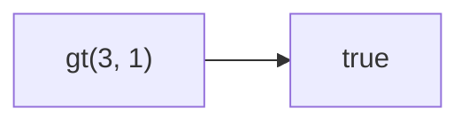

Checks if value is greater than other.
**Deprecated**: Use `>` operator directly.

```mermaid
flowchart LR
    A["gt(3, 1)"] --> B["true"]
```

### Native Equivalent

```typescript
// ❌ gt(a, b)
// ✅ a > b
```
