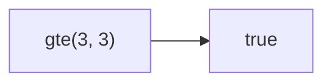

Checks if value is greater than or equal to other.
**Deprecated**: Use `>=` operator directly.

```mermaid
flowchart LR
    A["gte(3, 3)"] --> B["true"]
```

### Native Equivalent

```typescript
// ❌ gte(a, b)
// ✅ a >= b
```
