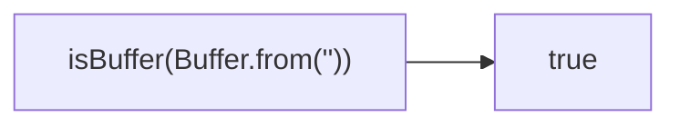

Checks if value is a buffer.
**Deprecated**: Use `Buffer.isBuffer()` directly in Node.js.

```mermaid
flowchart LR
    A["isBuffer(Buffer.from(''))"] --> B["true"]
```

### Native Equivalent

```typescript
// ❌ isBuffer(value)
// ✅ Buffer.isBuffer(value)
```
