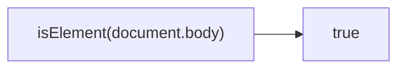

Checks if value is a DOM element.
**Deprecated**: Use `instanceof Element` directly.

```mermaid
flowchart LR
    A["isElement(document.body)"] --> B["true"]
```

### Native Equivalent

```typescript
// ❌ isElement(value)
// ✅ value instanceof Element
```
