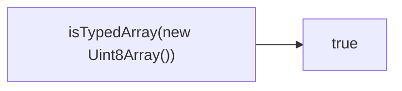

Checks if value is a typed array.
**Deprecated**: Use `ArrayBuffer.isView()` or instanceof checks.


### Native Equivalent

```typescript
// ❌ isTypedArray(value)
// ✅ ArrayBuffer.isView(value) && !(value instanceof DataView)
```
