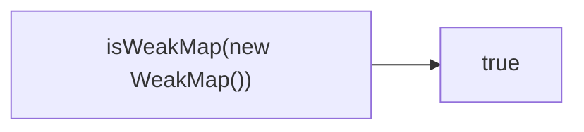

Checks if value is a WeakMap.
**Deprecated**: Use `instanceof WeakMap` directly.

```mermaid
flowchart LR
    A["isWeakMap(new WeakMap())"] --> B["true"]
```

### Native Equivalent

```typescript
// ❌ isWeakMap(value)
// ✅ value instanceof WeakMap
```
